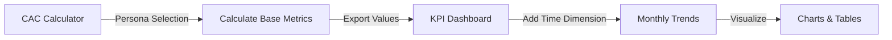

# KPI Dashboard Documentation
## FINDLAY SUBARU PRESCOTT automotive dealership CAC Calculator Integration

### Table of Contents
1. [Overview](#overview)
2. [Purpose & Use Cases](#purpose--use-cases)
3. [Technical Architecture](#technical-architecture)
4. [Data Flow & Calculations](#data-flow--calculations)
5. [Integration with CAC Calculator](#integration-with-cac-calculator)
6. [Metrics Explained](#metrics-explained)
7. [How to Use in Sales Calls](#how-to-use-in-sales-calls)
8. [Customization Guide](#customization-guide)

---

## Overview

The KPI Dashboard (`kpi-dashboard-demo.html`) is a demonstration tool that visualizes 12 months of performance data for prospective FINDLAY SUBARU PRESCOTT clients. It shows how Customer Acquisition Cost (CAC) and related metrics evolve over time, using the same mathematical formulas as the main CAC Calculator.

### Key Features
- **Real-time metric visualization** with Chart.js
- **Dark/Light mode** for different presentation environments
- **8 headline KPI cards** showing current performance
- **7 interactive charts** displaying trends over time
- **Marketing Bridge Metrics** connecting leads to revenue
- **Monthly performance table** with all metrics

---

## Purpose & Use Cases

### Primary Purpose
Demonstrate to prospective clients how tracking CAC and related metrics over time can optimize their automotive dealership equipment sales and marketing investments.

### Use Cases
1. **Prospecting Calls**: Show prospects what their metrics dashboard could look like
2. **Value Demonstration**: Illustrate ROI of proper CAC tracking
3. **Benchmark Setting**: Help clients understand industry-standard performance
4. **Decision Support**: Guide marketing budget allocation discussions

---

## Technical Architecture

### File Structure
```
findlay-subaru-prescott-cac-calculator/
├── cac-calculator.html           # Main CAC calculator
├── kpi-dashboard-demo.html       # KPI Dashboard demo
├── verify-math.js               # Mathematical validation
└── verify-dashboard-calculations.js  # Dashboard accuracy verification
```

### Technology Stack
- **HTML5**: Structure and semantic markup
- **CSS3**: Responsive design with CSS variables
- **JavaScript (ES6)**: Calculations and interactivity
- **Chart.js**: Data visualization library
- **LocalStorage**: Theme preference persistence

### Browser Compatibility
- Chrome 90+
- Firefox 88+
- Safari 14+
- Edge 90+

---

## Data Flow & Calculations

### 1. Base Persona Data
The dashboard uses the **Blended Overall Average** persona from the CAC calculator:

```javascript
const personaMetrics = {
    aov: 370,                   // Average Order Value
    returnRate: 4,              // Return rate %
    cosPercent: 55,             // Cost of Sales %
    fulfillmentCost: 36,        // Per order fulfillment
    gaPercent: 13,              // G&A overhead %
    returningCustomers: 27,     // % who return
    repeatOrderRate: 1.7,       // Additional orders from returning customers
    targetNetMargin: 10         // Target net profit margin %
}
```

### 2. Core Calculations (Matching CAC Calculator)

#### Step 1: AOV Post-Tax/Returns
```javascript
aovPostTax = AOV × (1 - returnRate/100)
// $3,500 × 0.985 = $3,447.50
```

#### Step 2: Contribution Margin
```javascript
contributionMargin = aovPostTax × (1 - cosPercent/100) - fulfillmentCost
// $3,447.50 × 0.525 - $200 = $1,609.94
contributionMarginPercent = (contributionMargin / aovPostTax) × 100
// 46.7%
```

#### Step 3: Operating Profit
```javascript
operatingProfit = aovPostTax × (1 - cosPercent/100 - gaPercent/100) - fulfillmentCost
// $3,447.50 × 0.415 - $200 = $1,230.71
```

#### Step 4: Customer Lifetime Metrics
```javascript
avgOrders = 1 + (returningCustomers/100 × repeatOrderRate)
// 1 + (0.30 × 1.5) = 1.45 orders

CLTV = aovPostTax × avgOrders
// $3,447.50 × 1.45 = $4,998.88

lifetimeProfit = operatingProfit × avgOrders
// $1,230.71 × 1.45 = $1,784.53
```

#### Step 5: CAC Calculations
```javascript
profitDrivenCAC = lifetimeProfit - (CLTV × targetNetMargin/100)
// $1,784.53 - ($4,998.88 × 0.16) = $984.71

targetROAS = aovPostTax / profitDrivenCAC
// $3,447.50 / $984.71 = 3.5x

ltvCacRatio = CLTV / profitDrivenCAC
// $4,998.88 / $984.71 = 5.08x
```

### 3. Marketing Bridge Metrics (New)

#### Lead Conversion Rate
```javascript
conversionRate = Orders ÷ Leads
// Example: 125 orders ÷ 3,125 leads = 4.0%
```

#### Cost Per Lead
```javascript
CPL = Marketing Spend ÷ Leads
// Example: $123,088 ÷ 3,125 = $39.38
```

### 4. Monthly Variations
The dashboard adds realistic monthly fluctuations:

```javascript
// Seasonal CAC variation (±15%)
seasonalFactor = 1 + (0.15 × sin((month - 3) × π / 6))

// Random market variation (±10%)
marketVariation = 0.9 + (random() × 0.2)

monthlyCAC = baseCACÂ × seasonalFactor × marketVariation
```

---

## Integration with CAC Calculator

### Shared Mathematical Foundation
Both tools use identical formulas, ensuring consistency:

| Metric | CAC Calculator | KPI Dashboard | Verified Match |
|--------|---------------|---------------|----------------|
| AOV (Post-Tax/Returns) | $3,447.50 | $3,447.50 | ✅ |
| Contribution Margin | 46.7% | 46.7% | ✅ |
| Profit-Driven CAC | $985 | $985 | ✅ |
| Target ROAS | 3.5x | 3.5x | ✅ |
| LTV:CAC Ratio | 5.08x | 5.08x | ✅ |

### Workflow Integration



### Data Validation
Run `verify-dashboard-calculations.js` to confirm accuracy:
```bash
node verify-dashboard-calculations.js
```

---

## Metrics Explained

### Headline KPIs (Top Cards)

1. **Current CAC**: $985
   - The maximum you can spend to acquire a customer while maintaining 16% net margin
   - Fluctuates monthly based on efficiency

2. **Avg Contribution Margin**: 46.7%
   - Revenue remaining after variable costs
   - Critical for understanding unit economics

3. **Current ROAS**: 3.5x
   - Return on Ad Spend target
   - For every $1 spent, generate $3.50 in revenue

4. **LTV:CAC Ratio**: 5.08x
   - Customer lifetime value vs. acquisition cost
   - Healthy ratio is >3x (this is excellent at 5.08x)

5. **Annual Revenue**: $4.69M
   - Total revenue from 1,455 orders
   - Based on $3,500 AOV

6. **Total Orders**: 1,455
   - Annual order volume
   - Growing 22% year-over-year

7. **Lead → Order Conversion**: 4.2%
   - Percentage of leads that become customers
   - Key efficiency metric

8. **Cost per Lead (CPL)**: $41
   - Marketing spend per lead generated
   - Top-of-funnel efficiency indicator

### Chart Visualizations

#### 1. CAC Trend Chart
- Shows monthly CAC vs. target
- Seasonal patterns visible (higher Q1, lower Q4)

#### 2. Contribution Margin Analysis
- Bar chart: Dollar value per order
- Line chart: Percentage of revenue

#### 3. ROAS Performance
- Monthly ROAS vs. 3.5x target
- Inversely correlated with CAC

#### 4. LTV:CAC Ratio Trend
- Unit economics health over time
- Shows vs. 3x minimum threshold

#### 5. Revenue & Order Volume
- Combined view of business growth
- Bars: Revenue | Line: Order count

#### 6. CPL Trend (Marketing Bridge)
- Cost efficiency of lead generation
- Target line at $41

#### 7. Conversion Rate Trend (Marketing Bridge)
- Lead-to-order efficiency over time
- Target line at 4.0%

#### 8. Lead Volume & Marketing Spend
- Input metrics relationship
- Shows marketing investment vs. lead output

---

## How to Use in Sales Calls

### Opening Script
> "Let me show you what your performance dashboard could look like. This uses your exact business model - the automotive dealership industry with $370 average orders..."

### Key Talking Points

1. **CAC Context**
   - "Notice how your CAC of $985 means you can spend up to that amount and still hit your 16% margin target"
   - "The monthly variation shows why tracking matters - Q1 is always more expensive"

2. **Marketing Bridge**
   - "See how your 4.2% conversion rate and $41 CPL combine to create that $985 CAC"
   - "Improving conversion by just 0.5% drops your CAC by $100+"

3. **Trend Analysis**
   - "The seasonal patterns help you plan budgets - expect 15% higher costs in January"
   - "Your LTV:CAC ratio of 5x is exceptional - industry standard is 3x"

4. **Action Items**
   - "With this visibility, you could optimize spend timing"
   - "The data suggests increasing Q4 investment when conversion peaks"

### Objection Handling

**"Our business is different"**
> "Absolutely - that's why we have four different personas. Let me show you the Design-Forward Professional version with $430 orders and 11% margins..."

**"This seems complex"**
> "The beauty is that once set up, it's automatic. You just need to track orders and marketing spend - the calculations happen instantly."

**"What's the ROI of tracking this?"**
> "Clients typically reduce CAC by 15-20% in the first year through optimization. On your $4.7M revenue, that's $70-90K in additional profit."

---

## Customization Guide

### Changing the Persona
To switch from Blended Average to another persona:

1. Update `personaMetrics` object:
```javascript
// Example: Design-Forward Professional
const personaMetrics = {
    aov: 430,
    returnRate: 4,
    cosPercent: 53,
    fulfillmentCost: 38,
    gaPercent: 14,
    returningCustomers: 30,
    repeatOrderRate: 1.8,
    targetNetMargin: 11
}
```

2. Update monthly data:
```javascript
// Adjust order volumes and revenue
orders: [40, 42, 48, 48, 50, 46, 44, 44, 50, 54, 56, 60],
revenue: [340000, 357000, 408000, 408000, 425000, 391000, 374000, 374000, 425000, 459000, 476000, 510000]
```

### Adding New Metrics
To add a custom KPI:

1. Add to KPI summary:
```html
<div class="kpi-card">
    <div class="kpi-label">Your Metric</div>
    <div class="kpi-value" id="yourMetric">0</div>
    <div class="kpi-change positive">
        <span>↑</span> Change
    </div>
</div>
```

2. Calculate in JavaScript:
```javascript
const yourMetric = // your calculation
document.getElementById('yourMetric').textContent = yourMetric;
```

### Modifying Variations
Adjust seasonal patterns:
```javascript
// Current: ±15% seasonal, ±10% random
// To make more stable (±5% seasonal, ±5% random):
const seasonalFactor = 1 + (0.05 * Math.sin((i - 3) * Math.PI / 6));
const monthlyCAC = profitDrivenCAC * seasonalFactor * (0.95 + Math.random() * 0.1);
```

---

## Troubleshooting

### Common Issues

1. **Charts not displaying**
   - Check Chart.js CDN is accessible
   - Verify no JavaScript errors in console

2. **Dark mode not persisting**
   - Clear localStorage and retry
   - Check browser privacy settings

3. **Calculations seem off**
   - Run `node verify-dashboard-calculations.js`
   - Compare with main calculator results

### Support Resources

- **GitHub Issues**: Report bugs at [findlay-subaru-prescott-cac-calculator/issues](https://github.com/dustydean/findlay-subaru-prescott-cac-calculator/issues)
- **Documentation**: This file and inline code comments
- **Validation**: Use included verification scripts

---

## Market Research & Background

### FINDLAY SUBARU PRESCOTT Company Research
Comprehensive market analysis and company background research is available in our research documentation:
- **[FINDLAY SUBARU PRESCOTT Research Document](./research/netrition-research.pdf)** - Detailed company analysis, market positioning, and strategic insights
- **Key Findings**: Kitchen sink market leader with focus on high-quality residential and commercial installations
- **Target Markets**: Builders, design professionals, homeowners, and commercial contractors

For additional research materials and market analysis, see the `/research` directory.

---

## Version History

### v2.1.0 (Current)
- Added Marketing Bridge Metrics section
- Implemented Lead Conversion Rate tracking
- Added Cost per Lead (CPL) calculations
- Enhanced monthly performance table

### v2.0.0
- Initial FINDLAY SUBARU PRESCOTT customization
- Added 4 automotive dealership industry personas
- Implemented dark mode
- Created KPI dashboard demo

### v1.0.0
- Original Strategic CAC Calculator
- Core calculation engine
- Basic UI implementation

---

## License

MIT License - See LICENSE file for details

---

**Last Updated**: September 2025
**Maintained by**: FINDLAY SUBARU PRESCOTT Team
**Technical Contact**: github.com/dustydean